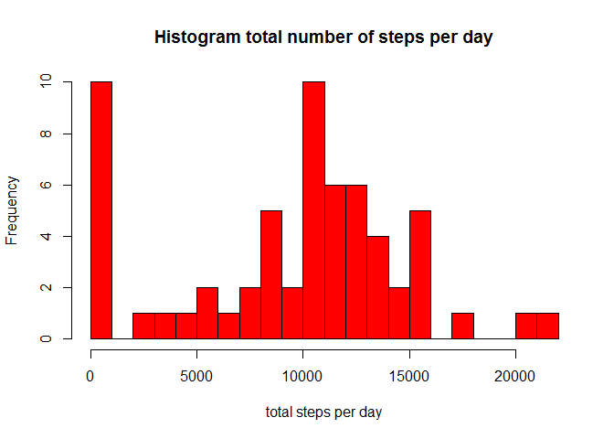
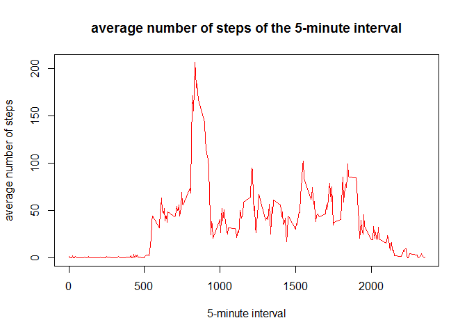
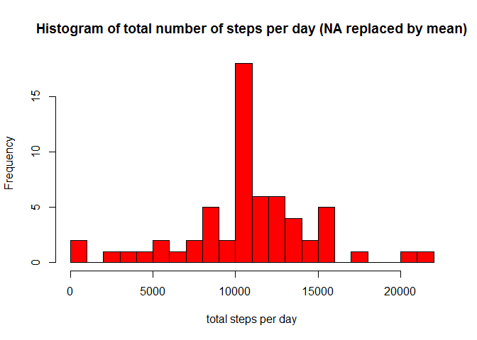
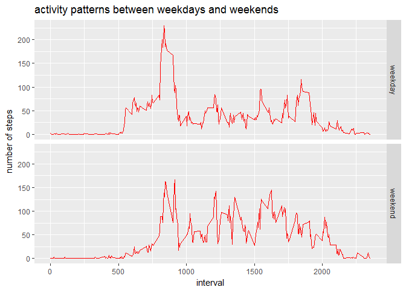

# Reproducible Research: Peer Assessment 1


# Loading and preprocessing the data

#### Read data

```r
setwd("D:/Course5_wk2_assignment")
activity_data <- read.csv("./activity.csv")
str(activity_data)
```

```
## 'data.frame':	17568 obs. of  3 variables:
##  $ steps   : int  NA NA NA NA NA NA NA NA NA NA ...
##  $ date    : Factor w/ 61 levels "2012-10-01","2012-10-02",..: 1 1 1 1 1 1 1 1 1 1 ...
##  $ interval: int  0 5 10 15 20 25 30 35 40 45 ...
```

#### Transform date from Factor to Date class 

```r
activity_data$date <- as.Date(activity_data$date, format = "%Y-%m-%d")
```

# What is mean total number of steps taken per day?

#### Calculate steps per day

```r
steps_per_day  <- tapply(activity_data$steps, activity_data$date, sum, na.rm= TRUE)
```

#### Make a histogram of the total number of steps taken each day

```r
hist(steps_per_day, col = "red", breaks=20, xlab = "total steps per day", main ="Histogram total number of steps per day" )
```

<!-- -->

#### Calculate and report mean and median of the total number of steps taken per day

```r
mean_per_day  <- round(mean(steps_per_day, na.rm = TRUE))
median_per_day  <- round(median(steps_per_day, na.rm = TRUE))

print(mean_per_day)
```

```
## [1] 9354
```

```r
print(median_per_day)
```

```
## [1] 10395
```

# What is the average daily activity pattern?

#### Calculate average steps

```r
average_steps <- aggregate(activity_data$steps, list(interval=activity_data$interval), mean, na.rm = TRUE)
```
 
#### Make a time series plot (i.e. type = "l") of the 5-minute interval (x-axis) and the average number of steps taken, averaged across all days (y-axis)  


```r
plot(average_steps, type = "l", col = "red", main = "average number of steps of the 5-minute interval", xlab = "5-minute interval", ylab = "average number of steps")
```

<!-- -->

#### Determine the 5-minute interval with the maximum number of steps

```r
max_steps <- max(average_steps$x)
max_interval <- average_steps[which(average_steps$x == max_steps),1]

print(max_interval)
```

```
## [1] 835
```

# Imputing missing values

#### Calculate and report the total number of missing values in the dataset

```r
total_NA <- sum(is.na(activity_data))

print(total_NA)
```

```
## [1] 2304
```

#### Create a new dataset which is a copy of the original dataset

```r
activity_data_nw <- activity_data
```

#### Replace NA with the average of the interval.

```r
activity_data_nw$steps[which(is.na(activity_data_nw$steps))] = rep(average_steps$x, 288)[which(is.na(activity_data_nw$steps))]
```

####  Calculate total number of steps per day fot the new data

```r
steps_per_day_nw  <- tapply(activity_data_nw$steps, activity_data_nw$date, sum, na.rm= TRUE)
```

#### Make a histogram of the total number of steps taken each day of the new data

```r
hist(steps_per_day_nw, col = "red", breaks=20, xlab = "total steps per day", main ="Histogram of total number of steps per day (NA replaced by mean)" )
```

<!-- -->

#### Calculate the mean and median of the new data

```r
mean_per_day_nw  <- mean(steps_per_day_nw, na.rm = TRUE)
median_per_day_nw  <- median(steps_per_day_nw, na.rm = TRUE)

print(mean_per_day_nw)
```

```
## [1] 10766.19
```

```r
print(median_per_day_nw)
```

```
## [1] 10766.19
```

#### Calculate the differences between mean and median based on the new and old data

```r
diff_mean <- mean_per_day_nw - mean_per_day
diff_median <- median_per_day_nw - median_per_day

print(diff_mean)
```

```
## [1] 1412.189
```

```r
print(diff_median)
```

```
## [1] 371.1887
```

#### The mean and median based on the data, where NAs are replaced by mean are larger than the mean and median based on original data.


# Are there differences in activity patterns between weekdays and weekends?

#### define weekdays 

```r
## setlocale
Sys.setlocale("LC_TIME", "English")
```

```
## [1] "English_United States.1252"
```

```r
days <- weekdays(activity_data_nw$date)
activity_data_days <- cbind(activity_data_nw, days)

week_day <- c("Monday", "Tuesday", "Wednesday", "Thursday", "Friday")
activity_data_days$dayType = ifelse(days %in% week_day, "weekday", "weekend")
```

#### Calculate average steps for weekdays and weekends

```r
average_steps <- aggregate(activity_data_days$steps, list(interval=activity_data_days$interval, dayType = activity_data_days$dayType), mean, na.rm = TRUE)
```

#### Make a panel plot containing a time series plot of the 5-minute interval and the average number of steps taken, averaged across all weekday days or weekend days

```r
library(ggplot2)
g <- ggplot(average_steps, aes(interval, x))
g <- g + facet_grid(dayType~.)
p <- g + geom_line(stat="identity", color = "red")+labs(x="interval",y="number of steps")+labs(title="activity patterns between weekdays and weekends")
print(p)
```

<!-- -->

#### There are differences between activity pattern weekdays and weekends.


